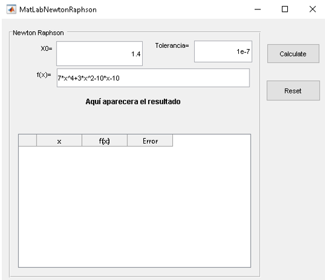
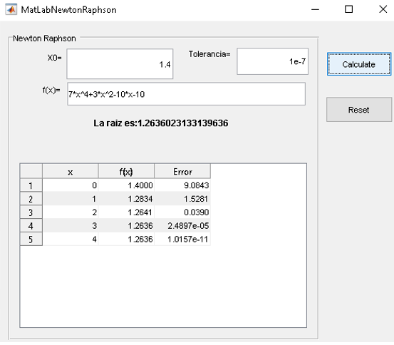

# matlab-newtonRaphson
Este proyecto demuestra como calcular raices con el metodo Newton-Raphson usando MatLab.

Updates
-------

__Mayo 2021__
- Se sube la primer versión funcional

Quick Code Tour
---------------

 - El archivo **MatLabNewtonRaphson.fig** debe abrirse con el comando GUIDE dentro de MatLab.  No es posible abrirlo con alguno otro software.
 - El archivo **MatLabNewtonRaphson.m** tiene toda la lógica para manejar la pantalla y realizar el calculo del metodo de Newton-Raphson, con los parametros que se configuran en pantalla.  Este es  un archivo de texto se puede abrir con su editor preferido.
 - La aplicación tiene predefinido unos valores para que al presionar el bóton Calculate, puedan ver el funcionamiento..

 
 - Esta es la pantalla inicial de la aplicación, despues de ingresar la tolerancia, el valor inicial de x y la funcion en terminos de x, se debe presionar click sobre el boton Calculate:

 
 - Se mostrará la raiz calculada con el metodo Newton Raphson, ademas se mostrará una tabla con todos los datos calculados en cada iteración.:
